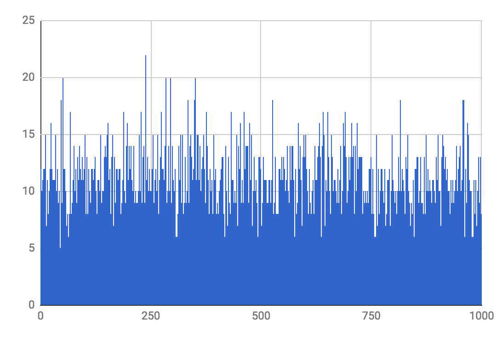

# Random for Solidity (eth-random)

<a href="https://zenhub.com"></a>

Our goal - Implementing a simple and cheap way to generate a random numbers of
arbitrary size, **as cheaply as possible, and up to multiple times per block**.

The motivation for this project came from the need of creating assets reliably and cheaply
for [CryptoKitties](https://www.cryptokitties.co/). One of the tradeoffs we are willing to
accept is that miners could influence the results. But also that they wouldn't be highly
financially motivated because the reward per "hack" would be too low to be make it worth it.

Ultimately the unpredictability and strength of this contract comes from the number of users
calling it _randomly_ - because every call alters the seed.

## Disclaimer

Given enough effort by an attacker, the output generated by eth-random can become close
enough to predictable.

Do **NOT** rely on this contract for any sort of luck based games that allows its users
to make a profit from it; including, but not limited to: lottery, card, dices.

Attempts to produce cheap RGNs and outsmart the network generating an RGN [tend to catastrophic failures](https://www.reddit.com/r/ethereum/comments/74d3dc/smartbillions_lottery_contract_just_got_hacked/?st=j9z5wwp3&sh=27cb460e), [really](http://martin.swende.se/blog/Breaking_the_house.html).


## Alternatives

3. There are oracles solutions [such as oraclize](https://docs.oraclize.it/#security-deepdive-advanced-datasources-random-data-source)
if you would rather rely on someone else contract
4.


## Caveats

Firstly, the block timestamp is not terribly unpredictable and yet it's one of the strongest sources
of entropy available in the blockchain along with contract's internal seed.

If security is a main focus, it may be best to look into purchasing an oracle solution [such as oraclize](https://docs.oraclize.it/#security-deepdive-advanced-datasources-random-data-source)

# Usage

For public networks, check contracts under [Releases](https://github.com/axiomzen/eth-random/releases).

### Using in truffle

Install with `npm install eth-random`

### Initialize and use random

Once you've located the contract's address, you can initialize the API with the address.

```solidity
import "eth-random/contracts/Random.sol";

contract Foo {
  Random api = Random(/* set address here */);

  function rollDice() returns (uint64) {
    return api.random(6);
  }
}
```

**See [a simple RPG example](./example/contracts/RPG.sol)**

## Stats

Run 10,000 on a 1,000 range, using `testrpc` on locahost [data spreadsheet](https://docs.google.com/spreadsheets/d/1pHbvrnQVrLT6R9oM-oozeI5d5uEIx-6eDhhZ8f5vkVg/edit#gid=0). Distribution:



average: 503.3
std deviation: 287.3

## Test

Have [truffle framework](http://truffleframework.com/) and [testrpc](https://github.com/ethereumjs/testrpc) installed and running.

`npm test`

## Contributing

Please see [CONTRIBUTING.md](./CONTRIBUTING.md)
